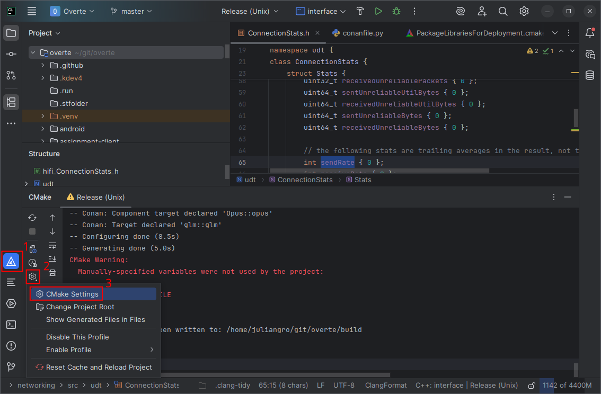
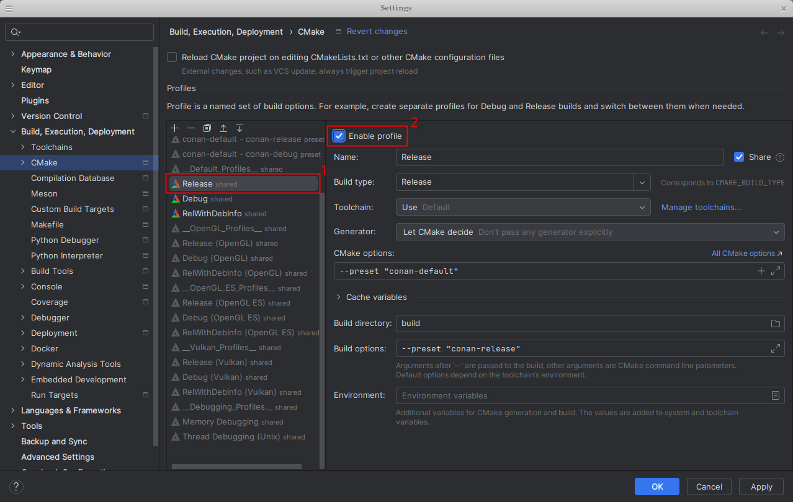
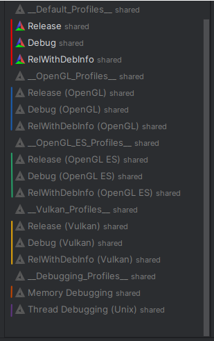
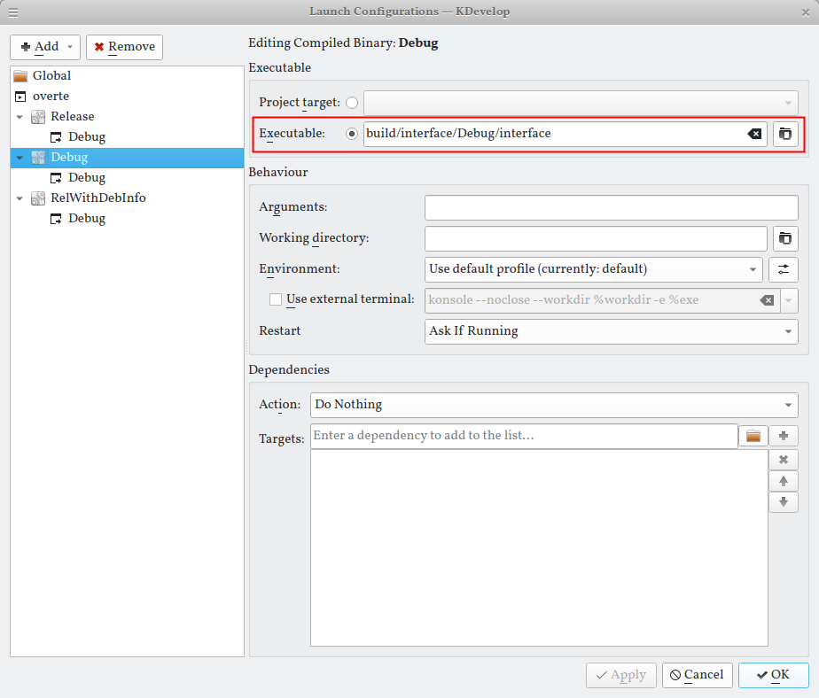
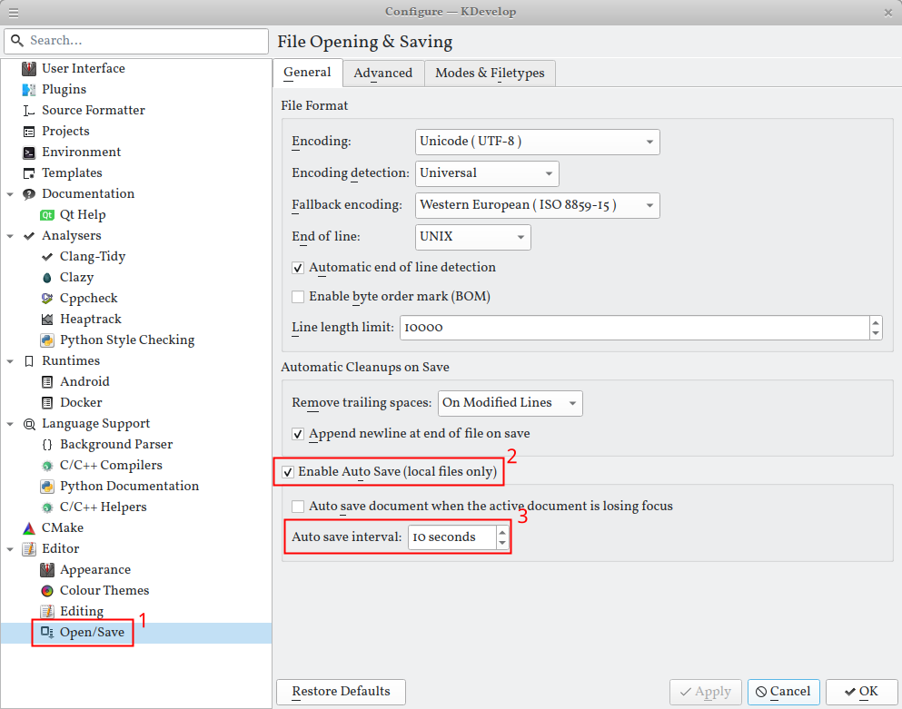

# CLion
While CLion is proprietary, it is free for non-commercial use. It supports pretty much everything,
is used by multiple team members, and runs on Linux, Windows, macOS. It is pretty much the same as Android Studio as well,
so it supports development for every Overte target platform.
You may want to use [Jetbrain's Toolbox app](https://www.jetbrains.com/toolbox-app/) to get automatic updates for CLion.

1. Generate the relevant CMake files for the platform you are on. E.g.: `conan install . -s build_type=Release -b missing -pr:b=default -of build -c tools.cmake.cmaketoolchain:generator="Ninja Multi-Config"`
   See the relevant BUILD_*.md for more details.

2. To work with different build types, run the `conan install` command again, replacing the `-s build_type=Release` with the relevant build type.
   E.g.: `-s build_type=Debug`. Valid build types are `Release`, `Debug`, and `RelWithDebInfo`.

3. Open CLion's "CMake Settings" and enable the relevant profile(s), e.g.: "Release", and press "OK".

   
   

   Now CLion should automatically switch to the CMake tab at the bottom and start configuring and generating.

   Keep in mind that only profiles with different build types can be enabled at the same time.
   Different CMake flags or environment variables cannot be enabled at the same time.
   Changing CMake flags or using a different category of profiles therefore requires you to disable the other profiles.
   Refer to the picture below, where the profiles are colored based on compatibility with each other:

   

3. Choose whatever target you want in the top right. Usually this is going to be "interface", which is Overte's client application.
   Keep in mind that the "interface" target is named "Overte" on macOS.

4. Now you at all set for building, running, and debugging.

## Tips
- `Enable QML language server` in CLion's settings to get warnings from qmllint. The binary is called `qmlls`.
  On Debian this is available in the `qt6-declarative-dev-tools` package and lives in `/usr/lib/qt6/bin/qmlls`.

# KDevelop
[KDevelop](https://kdevelop.org/) is a very powerful C++ IDE. While it suffers from some bugs, it is still one of the better IDEs for Overte development on Linux. It also has good QML support.

1. Generate the relevant CMake files for the platform you are on. E.g.: `conan install . -s build_type=Release -b missing -pr:b=default -of build -c tools.cmake.cmaketoolchain:generator="Ninja Multi-Config"`
   See the relevant BUILD_*.md for more details.
2. To work different build types, run the `conan install` command again, replacing the `-s build_type=Release` with the relevant build type.
   E.g. `-s build_type=Debug`. Valid build types are `Release`, `Debug`, and `RelWithDebInfo`.
3. Run `cmake --preset conan-default` to populate all CMake options for KDevelop.
4. Open your Overte repository using "Open Project" and accept all the defaults.
5. Under "Project" → "Open Configuration…" change your `CMAKE_BUILD_TYPE` to whatever build type you want to build. Valid options are `Release`, `Debug`, and `RelWithDebInfo`.
   You do not need to purge your build folder when changing your build type, or other CMake settings.
   If you change an environment variable, you may need to prune your build folder for it to apply. "Project" → "Prune Selection".
   After pruning, you need to rerun `conan install` for all relevant build types and rerun `cmake --preset conan-default`.
6. When you press Execute or Debug for the first time, KDevelop with prompt you to create a Launch Configuration.
   Select `overte` and press "Add" → "Compiled Binary" at the top.
   Name the launch configuration, for example to `Release`.
   Set the executable to `/PATH/TO/overte/build/interface/Release/interface`. (KDevelop will prepend your home folder it to the absolute path once you press OK.)
   Repeat this step for every build type you want to use; Replacing `Release` with `Debug` or `RelWithDebInfo`.

   

> [!WARNING]
> ***Any time you change your `CMAKE_BUILD_TYPE` you also need to change your launch configuration using "Run" → "Current Launch Configuration", otherwise you will run the wrong binary!***

## Tips
- Keep in mind that KDevelop may show incorrect warnings while it is still parsing code in the background.
- Make sure to have the `kdevelop-python` plugin installed when dealing with Conan recipes.
  The KDevelop Python plugin is developed separately from KDevelop itself, so it is not usually bundled with KDevelop.
- Enable auto saving, since you may lose a lot of work if KDevelop (or your computer) crashes.
  "Settings" → "Configure KDevelop…"
  "Editor" → "Open/Save" (all the way at the bottom)
  Enable "Auto Sav"e and set the "Auto save interval" to for example 10 seconds.
  
